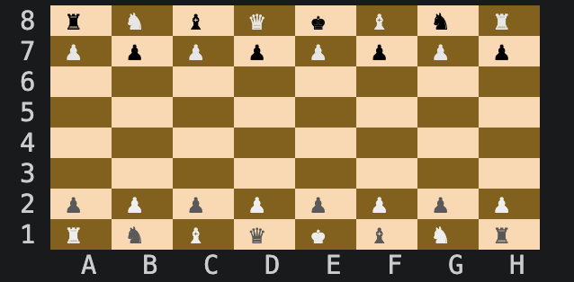

# Chess in C++

A terminal chess game written from scratch in C++20. It focuses on clean
object-oriented design, move validation, game flow, and readable terminal UI.

## Preview



## Features

- Unicode terminal board with white/black orientation
- Text input with coordinate notation, for example `e2 e4`
- Legal movement for all standard pieces
- Captures, score tracking, and captured-piece display
- Check, checkmate, and stalemate detection
- Prevention of moves that leave the king in check
- Castling and en passant
- Pawn promotion with selectable piece
- Commands for board, moves, history, status, draw, resign, and quit

## Build And Run

```bash
make
./chess
```

Or:

```bash
make run
```

## Commands

| Command | Description |
| --- | --- |
| `start` | Start the game |
| `e2 e4` | Move a piece |
| `board` | Redraw the board |
| `moves` | Show legal moves for a square |
| `history` | Show move history |
| `status` | Show game status |
| `captured` | Show captured pieces |
| `check` | Show check status |
| `help` | Show available commands |
| `rules` | Show input format and basic rules |
| `draw` | Offer a draw |
| `resign` | Resign the game |
| `quit` | Exit or resign during a game |

## Example

```text
Move history:
1. White: e2 e4   Black: d7 d5
2. White: e4 d5 captured Pawn
```

## Structure

```text
include/   headers
src/       implementations

Board/     board, square, coordinate, renderer
Game/      game loop, setup, result flow
Movement/  move parsing and validation
Pieces/    chess piece classes
Input/     input reading and normalization
History/   move history
```
